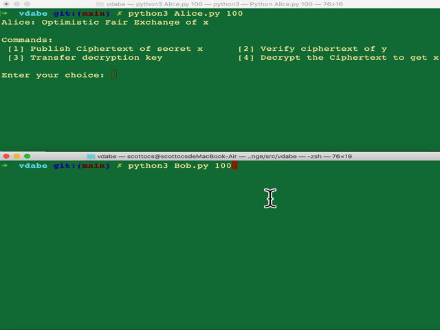

# File structure
newma.py: Lewko and Waters's decentralized CP-ABE with sigma protocol

Alice.py: the player Alice

Bob.py: the player Bob

ExternalUser.py: an external user (optional) who can verify all public information

## Prerequisition:
    1). pbc, gmp
    2). Charm-crypto at: https://jhuisi.github.io/charm/index.html
    3). gmpy2
    

## Test case (with 100 arbiters):
	1. open two terminal windows.
    2. run "python3 Alice.py 100" and "python3 Bob.py 100" in each terminal.
    3. accomplish the exchange protocol step by step.
    4. result:
    
    5. (optional) through running "python3 ExternalUser.py", an external user can verify all public information. 

## Note
All codes provided in this github are a proof of concept implementation of optimistic fair exchange protocol and are not audited for implmentation bugs. Use with caution.
